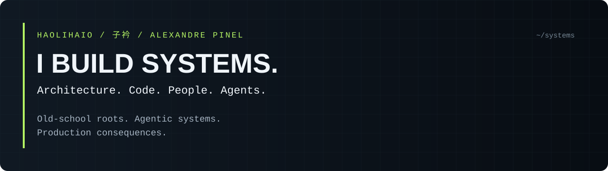

  

  <a href="https://alexandrepinel.com">Website &amp; writing</a> ·
  <a href="https://www.linkedin.com/in/alexandre-pinel-045807128/">LinkedIn</a> ·
  <a href="https://github.com/HaoLiHaiO?tab=repositories">Explore the repos</a>

# Alexandre Pinel · 子衿

**Software Architect · Senior Software Engineer · Engineering Leader · Entrepreneur**

I work where software architecture, cybersecurity and AI meet real operational constraints.

My scope runs from the shell to the system design, from reviewing code to leading engineers, from an idea to a business that has to work. I've worked across Europe and China, with teams spanning North America, Europe and East Asia.

I still care about what happens underneath the abstraction. I also want machines to do as much of the work as possible.

**The agents can write the code. I own the consequences.**

 

## Experience behind the terminal

- **Engineering leadership:** earlier management experience spanning organisations of up to 300 people.
- **Architecture and delivery:** enterprise applications, retail systems, web platforms, APIs, integrations and automation.
- **Knowledge transfer:** around 15 years of workshops, mentoring and technical sessions. Architecture should survive its architect.
- **International work:** different languages, cultures, time zones and ways of thinking. Translating requirements is only half the job.

Most enterprise work lives outside this public profile. These repositories are my workshop: tools, experiments, learning notes and products.

## Current operating mode

I work across the AI tooling ecosystem: **Codex CLI, Claude Code, Grok Code, other coding agents and assistants, and local models**. I combine them with **orchestrators, specs, `AGENTS.md`, isolated worktrees and review gates**.

The interesting problem is making the whole process reliable: keeping context, assigning ownership, testing changes, inspecting diffs and recovering when something goes wrong.

An agent saying "done" is a claim. Git, tests and runtime behaviour provide the evidence.

> Trust, but verify. Especially when the machine sounds confident.

## Inside the workshop

| Repository | What you'll find |
| --- | --- |
| [dotfiles](https://github.com/HaoLiHaiO/dotfiles) | My Linux configuration, including Bash setups for Arch and Ubuntu. |
| [check-if-git](https://github.com/HaoLiHaiO/check-if-git) | A small tool for finding project directories that aren't Git repositories. Context gets interrupted. Work should remain traceable. |
| [sys-audit](https://github.com/HaoLiHaiO/sys-audit) | A basic Linux audit script. Start by inspecting the machine. |

You'll also find learning exercises and forks here. A fork is a workbench, not a claim of authorship.

## Polyglot, on both sides of the keyboard

**Human languages**

I grew up with several languages, including German, English and Swiss German.

I speak **French, German, English, Swiss German, Luxembourgish, Mandarin, Bulgarian, Russian, Japanese and Dutch, at varying levels**. I lived in China and spent years in Varna, Bulgaria.

Languages are a way into people's thinking. Living somewhere teaches you things a dictionary never will.

**Machine languages & tools**

| Area | My toolkit |
| --- | --- |
| Code | TypeScript / JavaScript · Python · Go · Rust · C / C++ · Bash |
| Web & applications | React · Next.js · Node.js · Sanity · APIs |
| Systems & delivery | Arch Linux · Git · Docker · Kubernetes · CI/CD |
| Security | Nmap · Burp Suite · Wireshark · Kali Linux |
| Engineering with AI | Codex CLI · Claude Code · Grok Code · coding agents & assistants · local models · agent orchestration · repository context · automated verification |

## Beyond software

Machine learning, bioinformatics and the intersection of biology and computation keep pulling me into new territory.

Away from the keyboard: piano, flute, golf, hiking, swimming and heading somewhere remote.

Curiosity doesn't clock out.

---

**Bring a difficult system, a sharp technical question or something worth building.**

[alexandrepinel.com](https://alexandrepinel.com) · [Let's connect](https://www.linkedin.com/in/alexandre-pinel-045807128/)

